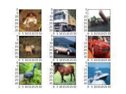

## Project Name

#### Image Classification With CNN

## Project Description
* Multi Class Classifing of CIFAR10  Dataset using CNN(Convolutional Neural Network) by building own neural network model.
* Build a model using Transfer Learning using VGG19.

### Methods Used
* Deep Learning
* Machine Learning

### Technologies 
* Python
* Keras
* Tensorflow
 
