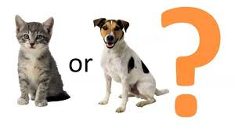

## Project Name

#### Image Classification With CNN

## Project Description
* Classifing if an image is a cat or a dog using CNN(Convolutional Neural Network.)

* I have build a CNN model from scratch without using Transfer Learning

* This Model is trained with 22500 images of cats and dogs and tested with 2500 images.

* This Model has an validation accuracy of 81.61%.

### Methods Used
* Deep Learning
* Machine Learning
* CNN

### Technologies 
* Python
* Keras
* Tensorflow

