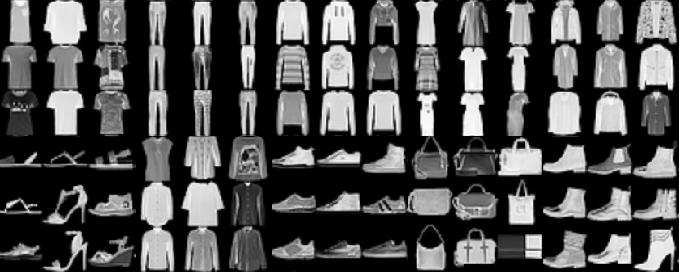

## Project Name

#### Image Classification With ANN

## Project Description
* Multi Class Classifing of Fashion MNIST Dataset using ANN(Artificial Neural Network.)

### Methods Used
* Deep Learning
* Machine Learning

### Technologies 
* Python
* Keras
* Tensorflow
 
